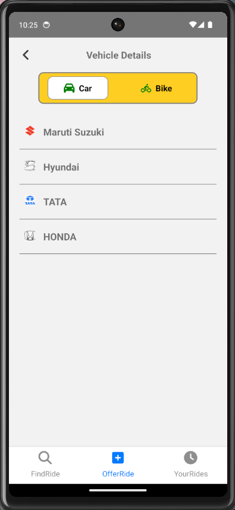
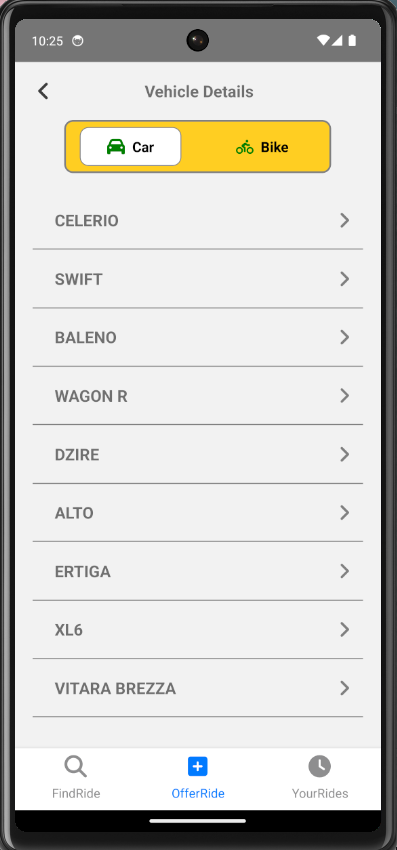
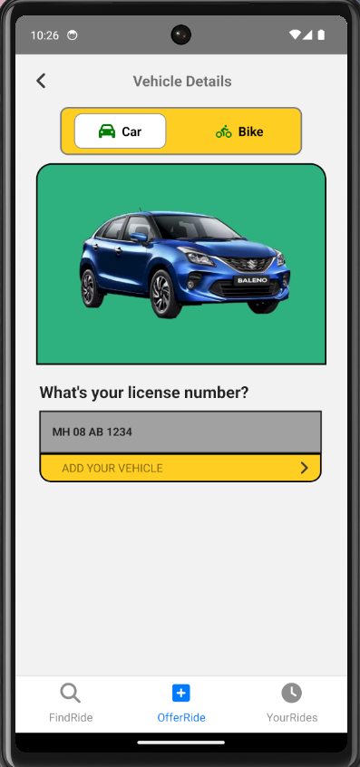

This is a new [**React Native**](https://reactnative.dev) project, bootstrapped using [`@react-native-community/cli`](https://github.com/react-native-community/cli).


# Ryder

Ryder is a React Native project designed to facilitate carpooling and ridesharing between drivers and passengers. Both drivers and passengers can log in, publish rides, or search for rides using the app's bottom sheet navigation. This document provides an overview of the application's key features and functionalities.

## Features

### User Authentication

- **Login:** Both drivers and passengers can log in to the application.
- **Registration:** New users can register to create an account.
- **Password Recovery:** Users can recover their passwords using the "Forgot?" option.


### Ride Posting

Drivers can post a ride by following these steps:

1. **Select Vehicle Type:** Choose between a car or a bike.
2. **Select Car/Bike Model:** Choose the vehicle's make and model (e.g., Maruti Suzuki, Hyundai, TATA, HONDA).
3. **Enter Vehicle Details:** Enter the vehicle registration number.
4. **Select Start Location:** Use the "Select Current Location" option or manually enter the start location.
5. **Select Destination:** Use the autosuggestion feature powered by an API to enter the destination.
6. **Select Time:** Choose the time of the ride.
7. **Select Seats:** Enter the total number of seats available.
8. **Publish Ride:** The ride is published and visible to all passengers.





### Ride Searching

Passengers can search for rides by:

1. **Enter Source and Destination:** Input the start and end locations.
2. **View Available Rides:** See a list of available rides with details such as time, vehicle type, and seats available.
3. **Join Ride:** Select a ride and pay through UPI. Payment details are taken during login.

### In-App Chat

- **Communication:** Drivers and passengers can communicate using an in-app chat feature implemented with React Native Gifted Chat and Firebase Database.
- **Location Sharing:** Passengers can share their current location with the driver.

### Bottom Sheet Navigation

- **Find Ride:** Allows passengers to search for rides.
- **Offer Ride:** Allows drivers to post a ride.
- **Your Rides:** Displays rides posted by the user or rides the user has joined.


## Technology Stack

- **React Native:** For building the mobile application.
- **Firebase Database:** For real-time chat and data storage.
- **Redux Toolkit:** For state management.
- **Redux Async Storage:** For storing User login info.
- **React Native Gifted Chat:** For chat functionality.
- **React Native Navigation:** For navigation functionality.
- **React Native Vector Icons:** For Icons.
- **API:** For location autosuggestions.

## Screenshots


## Getting Started

To get started with Ryder, follow these steps:

1. Clone the repository:
   ```bash
   git clone https://github.com/ShubhamMaurya22/ryder.git


# Getting Started

>**Note**: Make sure you have completed the [React Native - Environment Setup](https://reactnative.dev/docs/environment-setup) instructions till "Creating a new application" step, before proceeding.

## Step 1: Start the Metro Server

First, you will need to start **Metro**, the JavaScript _bundler_ that ships _with_ React Native.

To start Metro, run the following command from the _root_ of your React Native project:

```bash
# using npm
npm start

# OR using Yarn
yarn start
```

## Step 2: Start your Application

Let Metro Bundler run in its _own_ terminal. Open a _new_ terminal from the _root_ of your React Native project. Run the following command to start your _Android_ or _iOS_ app:

### For Android

```bash
# using npm
npm run android

# OR using Yarn
yarn android
```

### For iOS

```bash
# using npm
npm run ios

# OR using Yarn
yarn ios
```

If everything is set up _correctly_, you should see your new app running in your _Android Emulator_ or _iOS Simulator_ shortly provided you have set up your emulator/simulator correctly.

This is one way to run your app — you can also run it directly from within Android Studio and Xcode respectively.

## Step 3: Modifying your App

Now that you have successfully run the app, let's modify it.

1. Open `App.tsx` in your text editor of choice and edit some lines.
2. For **Android**: Press the <kbd>R</kbd> key twice or select **"Reload"** from the **Developer Menu** (<kbd>Ctrl</kbd> + <kbd>M</kbd> (on Window and Linux) or <kbd>Cmd ⌘</kbd> + <kbd>M</kbd> (on macOS)) to see your changes!

   For **iOS**: Hit <kbd>Cmd ⌘</kbd> + <kbd>R</kbd> in your iOS Simulator to reload the app and see your changes!

## Congratulations! :tada:

You've successfully run and modified your React Native App. :partying_face:

### Now what?

- If you want to add this new React Native code to an existing application, check out the [Integration guide](https://reactnative.dev/docs/integration-with-existing-apps).
- If you're curious to learn more about React Native, check out the [Introduction to React Native](https://reactnative.dev/docs/getting-started).

# Troubleshooting

If you can't get this to work, see the [Troubleshooting](https://reactnative.dev/docs/troubleshooting) page.

# Learn More

To learn more about React Native, take a look at the following resources:

- [React Native Website](https://reactnative.dev) - learn more about React Native.
- [Getting Started](https://reactnative.dev/docs/environment-setup) - an **overview** of React Native and how setup your environment.
- [Learn the Basics](https://reactnative.dev/docs/getting-started) - a **guided tour** of the React Native **basics**.
- [Blog](https://reactnative.dev/blog) - read the latest official React Native **Blog** posts.
- [`@facebook/react-native`](https://github.com/facebook/react-native) - the Open Source; GitHub **repository** for React Native.
